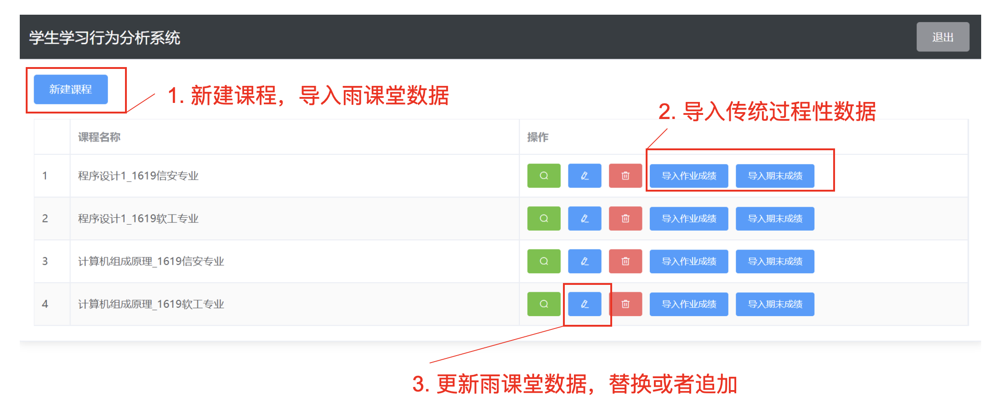
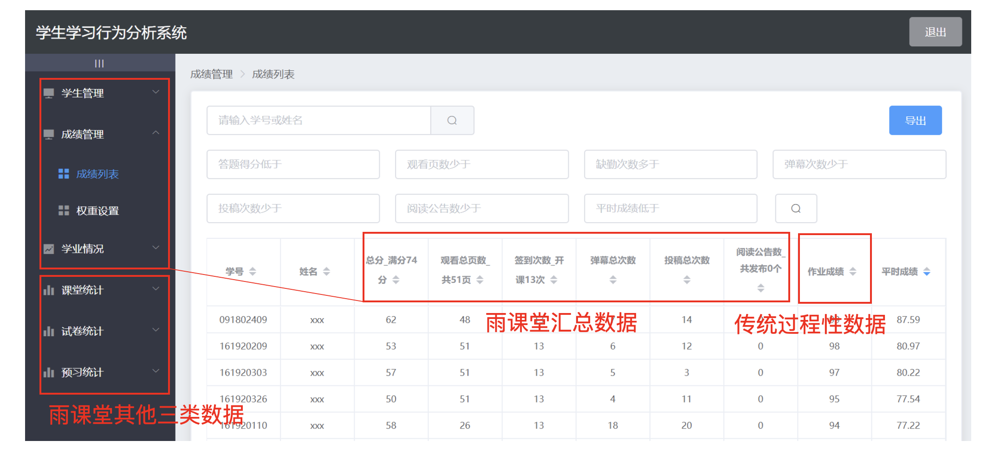
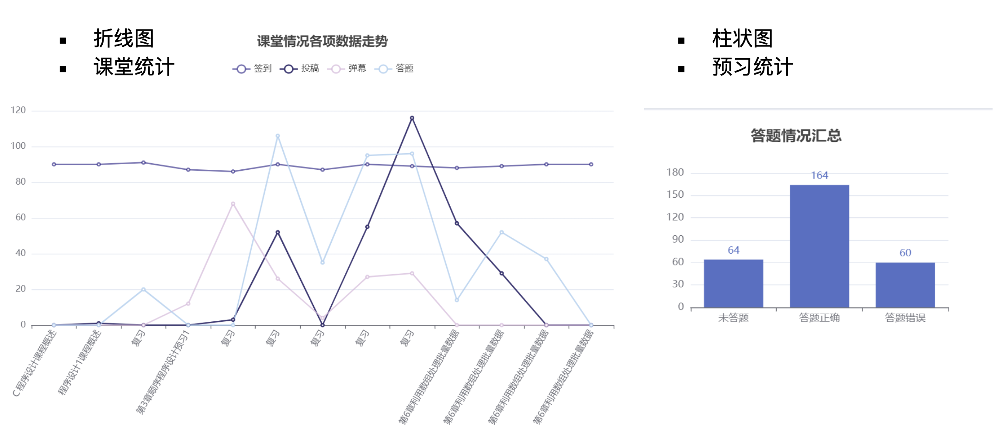
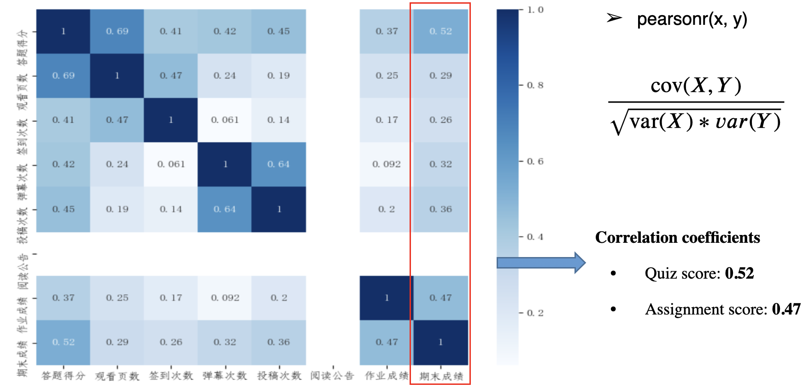
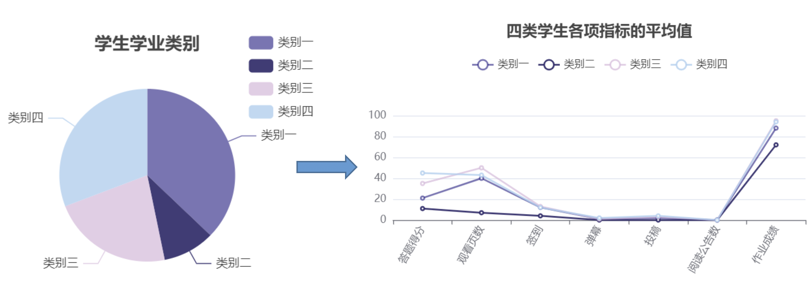
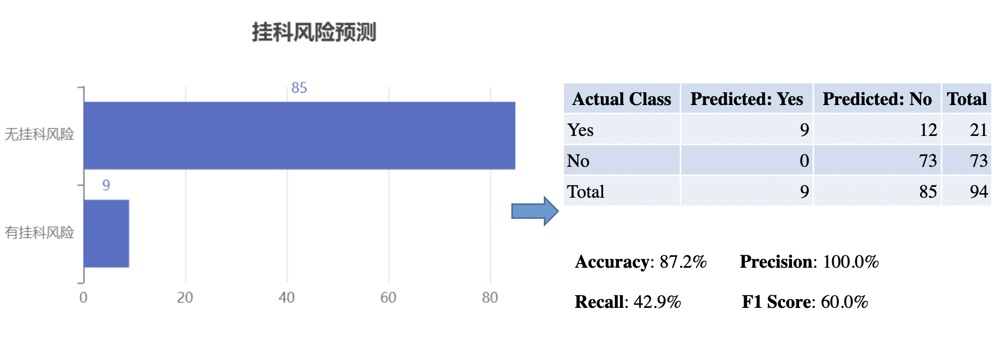

# Design and Implementation of Student Learning Behavior Analysis Software

## Introduction

This software is designed to analyze student learning behaviors, help instructors understand student engagement and performance, and provide data-driven support for teaching improvement and academic warning systems.

---

## Features

### Main functionalities

- **Import course data**  
  Instructors can import course-related data, including attendance, participation, and assignment records.

  

- **View student learning behavior information**  
  Detailed behavior metrics are displayed for each course, including individual and overall class insights.
  
  

---

## Data Analysis

The system offers comprehensive analysis functions, including statistical and machine learning methods.

### Statistical methods

1. **Trend analysis of various classroom metrics and question-answering summaries**  
   Visualizes trends in attendance, participation, and in-class question responses to help instructors monitor learning dynamics.

   

2. **Pearson correlation analysis with final grades**  
   Identifies which behavioral metrics (e.g., attendance rate, participation frequency) are most strongly correlated with final academic performance.

   

---

### Machine learning methods

The backend integrates Python scripts to run advanced analysis algorithms and automatically generate visualization images for the frontend.

1. **Student classification using K-Means clustering**  
   Groups students into categories based on behavior data, helping instructors recognize different learning patterns and tailor support.

   

2. **Academic warning using C4.5 decision tree**  
   Uses a decision tree model to identify students at risk of failing or dropping out, enabling early intervention and personalized guidance.

   
